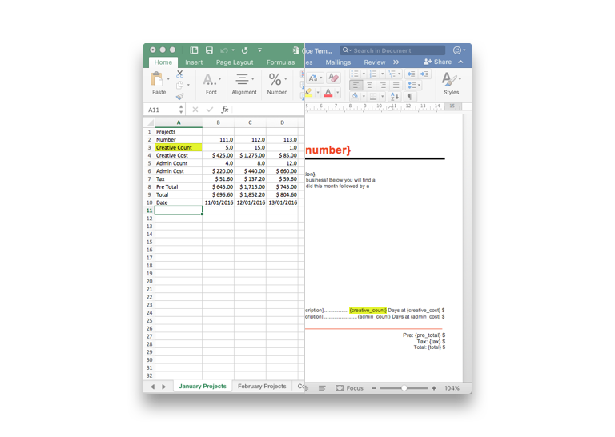
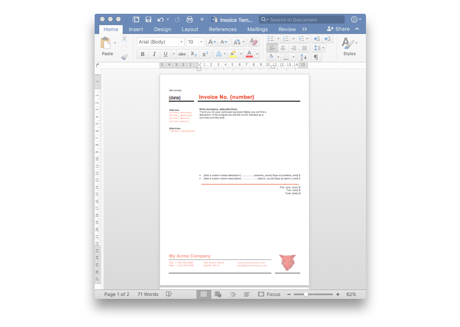
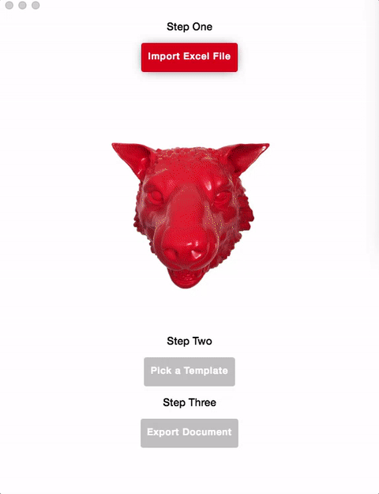

# Excel2Word


Excel2Word is a simple electron app that takes column based entries in an excel worksheet and runs them through a word template - generating single and multi-page word documents depending on your configuration. This is still in early development so if you find a bug or major missing feature, [please file an issue](https://github.com/motleydev/excel2word/issues)! Thanks!

> [Download the app now!](https://github.com/motleydev/excel2word/releases/download/v0.10.0-beta/Excel2Word.zip) or [checkout the releases page](https://github.com/motleydev/excel2word/releases).
> 

[](http://standardjs.com)

## Why build an app?
If you are not in a situation where your office files NEED to live off-line, I would highly recommend pursuing a solution built with the modern [Office.js](https://dev.office.com/reference/add-ins/javascript-api-for-office) library. All of the features present can be recreated entirely in office. This app is only helpful for those who need off-line excel parsing.

## Documentation

The app workflow is a total of four steps.
1.  Upload a file.
2.  Choose which sheets you want to process and set configuration options.
3.  Choose a word template to use.
4.  Hit the export button!

The first two steps look like this:


In screenshot **a)** you can import an excel document.
In **b)** you select which sheets you want to process. As my sheet mimics an invoice utility, I am renaming the first sheet to *invoices* which I will then reference in my word template. Since I will be reusing the template often, it is easier to rename the data set here as opposed to renaming my word document syntax markers each time.
At screen **c)** I am telling the processor that my data is not serialized, which will make the reference values in my left-hand column available globally in my template. This will make more sense when we get to templating.

There is optional support for adding a JSON schema file for customizing the mapping of data. Again, this will make more sense when we get to templating.

For reference, here is the excel document being parsed:


Now we have our sheets imported, it's time to confirm our data is processed and ready for export. Here's how that looks:


In screenshot **a)**, you can pick which columns you want to view. Notice the red gear in the bottom left corner, you can always change your column headers here.
In **b)** you will choose a word document with the embedded syntax to act as our template.
At screen **c)** My documents are uploaded, I've verified the data is present and I am ready for export!

### Templating

By default, the names of each worksheet in the excel file contain an array of serialized data for looping over. Each row of data takes the furthest left (column A or C1) value as it's entry. For example, if you look at the first excel sheet, there is a label called "Creative Count" - this will get cleaned and processed to be "creative_count" instead. In the template, I use the handlebars inspired tagging method `{creative_count}`. Anything omitted from the JSON file simple gets discarded.

If I provided a JSON schema with the following syntax:

```JSON
{
	"creative": {
		"count": "creative_count",
		"cost": "creative_cost"
	}
}
```

my data would be available in the template as `{creative.count}` and `{creative.cost}` respectively. This is helpful when working with multiple international files where the labels might change in name but you want to use the same word document to maintain style and brand.

Here's an example of how that looks:



The library for processing the word document is called [Docxtemplater](https://docxtemplater.com/) and it has extensive documentation on the [supported syntax](https://docxtemplater.readthedocs.io/en/latest/syntax.html). The angular expressions plugin is also implemented, so you can use almost all the syntax helpers found at this [angular expressions cheat-sheet](https://teropa.info/blog/2014/03/23/angularjs-expressions-cheatsheet.html).

The essential syntax to loop over the array of entries is called *loop syntax*, in the case of my invoices data, it looks like this: `{#invoices} {/invoices}` - any data you reference between these brackets such as my `{creative_count}` value will refer to the immediate scope of that column of data. Examples are in the [reference folder](https://github.com/motleydev/excel2word/tree/master/reference).

Here's an example of my word template:



Notice that my closing `{/invoices}` tag is actually on the next page after a page-break, that enforces that each invoice gets its own page.

## Movie Time!
What's a modern day doc without a gif?



## That's it for now!
Thank you for checking out Excel2Word - it's my first app and I am really excited about the electron platform. If you have any questions, please feel free to reach out. [Now go download it!](https://github.com/motleydev/excel2word/releases/download/v0.10.0-beta/Excel2Word.zip)

### List of features to add:
- [ ] Add support for row based projects
- [ ] Add "clear data" function, right now you have to quit the app and reboot.
- [ ] Add ability to change data in the table view.

## Credits
This app is built on the [Electron](http://electron.atom.io/) platform

It is based on the excellent [react-electron-boilerplate](https://github.com/chentsulin/electron-react-boilerplate).


## License

[MIT License](http://opensource.org/licenses/mit-license.php)
